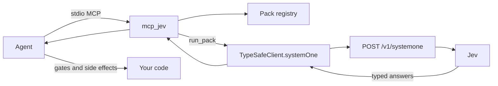

# mcp_jev

Local MCP server that runs **TypeSafe Jev** (System One) **packs** — typed **Choice / Noul / Score** judgments, not chat.

Anyone runs it **on their own PC** with **their own** TypeSafe API key. This repo does not host Jev, proxy your key, or invent a free-form `ask_jev` tool.

Jev is having a moment because it is actually a different interface: you send state and questions, you get numbers and labels your code can `if` on. Ride that — and stay honest. Side effects stay in the agent.

**Docs (source of truth):** [https://docs.typesafe.ai](https://docs.typesafe.ai) · index: [llms.txt](https://docs.typesafe.ai/llms.txt)

Agent install deep dive: [docs/INSTALL_AGENTS.md](docs/INSTALL_AGENTS.md) · skill: [skills/mcp_jev/SKILL.md](skills/mcp_jev/SKILL.md)

- [Why this is not an LLM wrapper](#why-this-is-not-an-llm-wrapper)
- [Prerequisites](#prerequisites)
- [Install locally](#install-locally)
- [Install for agents & IDEs](#install-for-agents--ides)
- [Agent instructions](#agent-instructions)
- [Tools](#tools-closed-catalog)
- [Packs](#packs)
- [Environment / security](#environment)
- [Troubleshooting](#troubleshooting)

## Why this is not an LLM wrapper

| | Jev (System One) | Chat LLM |
| --- | --- | --- |
| Input | State + closed questions | Prompt / conversation |
| Output | `choice` / `noul` / `score` + probabilities | Prose you must parse |
| Control | Your code composes answers | The model narrates a plan |
| This MCP | Runs a **pack** | Out of scope |

JavaScript SDK (what this server calls):

```ts
import { choice, noul, score, TypeSafeClient } from "@typesafe-ai/sdk";

const client = new TypeSafeClient(); // reads TYPESAFE_API_KEY
await client.systemOne({
  state: { /* pack state */ },
  questions: {
    intent: choice("…", { faq: "…", action: "…" }),
    jailbreak: noul("…"),
    urgency: score("…", ["routine", "soon", "emergency"]),
  },
  model: "jev-latest",
});
```

Python exists (`typesafe-sdk`, `client.system_one`) if you are writing app code. This server is TypeScript / Node 20+.

## Prerequisites

1. **Node.js 20+** (`node -v`). The package `engines` field is `>=20`.
2. A **TypeSafe account and API key** from the [TypeSafe dashboard](https://console.typesafe.ai). Required only for `run_pack`. `list_packs`, `describe_pack`, and `ping` work without one.
3. An MCP host that can spawn a **local stdio** server (Cursor, Claude Desktop/Code, Codex, Grok, Antigravity, Windsurf, Cline, Continue, Zed, …). This repo is not an HTTP service.

## Install locally

Use a placeholder path. Replace `REPO_PATH` everywhere.

```bash
# Example only (Pedro's typical Desktop checkout):
#   REPO_PATH=/Users/pedroknigge/Desktop/mcp_jev
export REPO_PATH="$HOME/src/mcp_jev"

git clone https://github.com/pedroknigge/mcp_jev.git "$REPO_PATH"
cd "$REPO_PATH"
npm install
npm run build
npm test
```

`npm test` mocks TypeSafe. It must pass without `TYPESAFE_API_KEY`. Do not call the live API unless you have a key and intend to.

The server **does not load `.env` files**. Copy `.env.example` → `.env` only as a reminder for your shell:

```bash
cp .env.example .env
# edit TYPESAFE_API_KEY, then:
set -a && source .env && set +a
```

MCP hosts must put the key in the server's **`env` block**. A key sitting in `.env` or your login shell is invisible to Cursor/Claude/Codex unless you copy it into the host config.

### Dev vs `npx`

| How you run it | Command | When |
| --- | --- | --- |
| Built clone (preferred) | `node "$REPO_PATH/dist/index.js"` | Everyday host config. Fast, no download. |
| TypeScript in this repo | `npx tsx src/index.ts` | Local hacking only. |
| npm scripts after build | `npm start` | Same as `node dist/index.js`. |
| Git via npx | `npx -y github:pedroknigge/mcp_jev` | No clone. First launch fetches + runs `prepare` (`tsc`). Hosts may need a longer startup timeout. |
| Published package | `npx -y mcp_jev` | **Not on the public npm registry yet.** Use this stanza once it is. |

`npx` / `node dist/index.js` speak **stdio** MCP. Do not `console.log` at stdout. Bin name in `package.json`: **`mcp_jev`** → `dist/index.js`.

## Install for agents & IDEs

Same stdio server, different config files. After you paste a stanza, **restart the host** (Claude Desktop: full quit, not just the window). Then the agent should `ping` then `list_packs`.

Generic shape most JSON hosts accept:

```json
{
  "mcpServers": {
    "mcp_jev": {
      "command": "node",
      "args": ["/absolute/path/to/mcp_jev/dist/index.js"],
      "env": {
        "TYPESAFE_API_KEY": "YOUR_KEY"
      }
    }
  }
}
```

Use an **absolute** path. Relative `args` break when the host's cwd is not the repo.

### Cursor

Project (this workspace only): `.cursor/mcp.json`  
User (all projects): `~/.cursor/mcp.json`  
Merged; **project wins** on the same server name.

Local clone:

```json
{
  "mcpServers": {
    "mcp_jev": {
      "command": "node",
      "args": ["/Users/pedroknigge/Desktop/mcp_jev/dist/index.js"],
      "env": {
        "TYPESAFE_API_KEY": "YOUR_KEY"
      }
    }
  }
}
```

Replace that Desktop path with your `REPO_PATH`. Git / future npm:

```json
{
  "mcpServers": {
    "mcp_jev": {
      "command": "npx",
      "args": ["-y", "github:pedroknigge/mcp_jev"],
      "env": {
        "TYPESAFE_API_KEY": "YOUR_KEY"
      }
    }
  }
}
```

When the package is on npm, swap the args for `["-y", "mcp_jev"]`. Optional: `TYPESAFE_BASE_URL`, `JEV_MODEL` (default `jev-latest`; the SDK also reads `TYPESAFE_DEFAULT_MODEL`).

Install the skill so the model does not treat Jev like ChatGPT:

```bash
mkdir -p .cursor/skills
cp -R skills/mcp_jev .cursor/skills/mcp_jev
# or user-wide: cp -R skills/mcp_jev ~/.cursor/skills/mcp_jev
```

`npx skills add pedroknigge/mcp_jev --skill mcp_jev` — see [skills/mcp_jev/README.md](skills/mcp_jev/README.md).

### Claude Desktop

Edit via **Settings → Developer → Edit Config**, then fully quit and reopen.

| OS | `claude_desktop_config.json` |
| --- | --- |
| macOS | `~/Library/Application Support/Claude/claude_desktop_config.json` |
| Linux | `~/.config/Claude/claude_desktop_config.json` |
| Windows | `%APPDATA%\Claude\claude_desktop_config.json` |

```json
{
  "mcpServers": {
    "mcp_jev": {
      "command": "node",
      "args": ["/absolute/path/to/mcp_jev/dist/index.js"],
      "env": {
        "TYPESAFE_API_KEY": "YOUR_KEY"
      }
    }
  }
}
```

On Windows, if `npx` is not a real executable, wrap it: `"command": "cmd", "args": ["/c", "npx", "-y", "github:pedroknigge/mcp_jev"]`.

### Claude Code

CLI (stdio). Put `--` before the server command. Do not put the server name immediately after `--env`.

```bash
claude mcp add --scope user --env TYPESAFE_API_KEY=YOUR_KEY --transport stdio mcp_jev \
  -- node /absolute/path/to/mcp_jev/dist/index.js
```

Project-shared file: `.mcp.json` (same `mcpServers` JSON as Cursor). Verify: `claude mcp list`. Skill:

```bash
mkdir -p .claude/skills
cp -R skills/mcp_jev .claude/skills/mcp_jev
# or: npx skills add pedroknigge/mcp_jev --skill mcp_jev
```

### OpenAI Codex (CLI / IDE / ChatGPT desktop Codex host)

Codex stores MCP in **TOML**, not JSON. User: `~/.codex/config.toml`. Project (trusted repos): `.codex/config.toml`. The CLI, IDE extension, and ChatGPT desktop Codex host share this file.

```bash
codex mcp add mcp_jev --env TYPESAFE_API_KEY=YOUR_KEY \
  -- node /absolute/path/to/mcp_jev/dist/index.js
```

```toml
[mcp_servers.mcp_jev]
command = "node"
args = ["/absolute/path/to/mcp_jev/dist/index.js"]

[mcp_servers.mcp_jev.env]
TYPESAFE_API_KEY = "YOUR_KEY"
```

If you only have a JSON `mcpServers` block, paste it into hosts that speak JSON. For Codex, convert to the TOML above (key is `mcp_servers`, underscore). `npx` first-run may need `startup_timeout_sec = 60`.

### Grok / xAI agent hosts

[xAI MCP docs](https://docs.x.ai/build/features/mcp-servers): `~/.grok/config.toml` or project `.grok/config.toml`. CLI: `grok mcp add`. Grok can also merge `.cursor/mcp.json` / `.mcp.json`; `~/.grok/config.toml` still wins.

```toml
[mcp_servers.mcp_jev]
command = "node"
args = ["/absolute/path/to/mcp_jev/dist/index.js"]
startup_timeout_sec = 30

[mcp_servers.mcp_jev.env]
TYPESAFE_API_KEY = "${TYPESAFE_API_KEY}"
```

`${VAR}` expands at load time — keep the real key out of the file when your environment already has it. Other xAI/Grok surfaces that only take JSON: use the generic `mcpServers` stdio block at the top of this section.

### Google Antigravity

Antigravity **does** speak MCP. Custom stdio servers go in:

- Global: `~/.gemini/config/mcp_config.json`
- Workspace: `.agents/mcp_config.json`

UI: agent panel **… → MCP Servers → Manage MCP Servers → View raw config**.

```json
{
  "mcpServers": {
    "mcp_jev": {
      "command": "node",
      "args": ["/absolute/path/to/mcp_jev/dist/index.js"],
      "env": {
        "TYPESAFE_API_KEY": "YOUR_KEY"
      }
    }
  }
}
```

Also copy the skill (`skills/mcp_jev`) into the workspace skills directory the agent reads (often `.agents/skills` or `.gemini/skills`). If a given Antigravity surface will not spawn stdio, the fallback is still: run this server from any MCP host + follow the skill (`list_packs` → `describe_pack` → `run_pack`). Do not invent HTTP endpoints; this package is stdio-only.

### Windsurf / Cline / Continue / Zed

Same server; different files. Full stanzas: [docs/INSTALL_AGENTS.md](docs/INSTALL_AGENTS.md).

| Host | Where | Root key |
| --- | --- | --- |
| **Windsurf** | `~/.codeium/windsurf/mcp_config.json` | `mcpServers` (stdio: `command` / `args` / `env`) |
| **Cline** | IDE: MCP Servers → Configure. File is often `cline_mcp_settings.json` under VS Code `globalStorage/saoudrizwan.claude-dev`. CLI: `~/.cline/mcp.json` | `mcpServers` |
| **Continue** | `~/.continue/config.yaml` or `.continue/mcpServers/*.yaml` (JSON from Cursor also works in that folder) | YAML `mcpServers:` list with `command` / `args` / `env` |
| **Zed** | Settings → AI → MCP Servers, or `~/.config/zed/settings.json` | **`context_servers`**, not `mcpServers` |

Zed:

```json
{
  "context_servers": {
    "mcp_jev": {
      "command": "node",
      "args": ["/absolute/path/to/mcp_jev/dist/index.js"],
      "env": {
        "TYPESAFE_API_KEY": "YOUR_KEY"
      }
    }
  }
}
```

## Agent instructions

Paste this into any agent that can see the MCP tools:

> You have **mcp_jev**, a local MCP server for TypeSafe **Jev** (System One) packs. Jev is **not** an LLM chat model. There is no `ask_jev` tool.
>
> Always: `list_packs` → `describe_pack` → collect short named state in code → `run_pack` `{ pack_id, state }`. Never invent free-form questions, endpoints, or answer fields.
>
> Side effects (merge, comment, refund, catalogue write, refuse) stay in **your** code or other tools. Do not put `TYPESAFE_API_KEY` in chat. If `ping` shows `api_key_set: false`, stop and tell the human to set the key in the MCP `env` block. If `run_pack` returns `invalid_state`, re-read `describe_pack` — do not guess extra fields.

## Tools (closed catalog)

| Tool | Args | What it does |
| --- | --- | --- |
| `list_packs` | none | `id`, `version`, `title`, `summary`, `when_to_use` |
| `describe_pack` | `pack_id` | JSON Schema, questions, `example_state`, `suggested_workflow`, `notes` |
| `run_pack` | `pack_id`, `state` | Validates state, calls TypeSafe `systemOne`, returns typed answers + usage. Errors if the key is missing. **No side effects.** |
| `ping` | none | Server + SDK versions, pack count, `api_key_set`, model. **Never** echoes the key |

There is **no** free-form ask tool. Agents: `list_packs` → `describe_pack` → `run_pack`.

`list_packs` / `describe_pack` / `ping` never call TypeSafe. Only `run_pack` does.

## Packs

| id | What Jev judges | What **you** still do |
| --- | --- | --- |
| `pr_audit` | `merge_risk` (safe_ui \| needs_review \| block), Nouls money / hours / hours_money_boundary / migration, Score `blast_radius` | Compute **`code_gate`** in the caller. Jev does not merge or comment |
| `intent_router` | Closed intent Choice, jailbreak + policy Nouls, urgency Score | Route / refuse / hand off in code |
| `locale_country` | Catalogue item → Argentina \| USA \| India \| Uruguay \| Saudi Arabia (or `unclear`) | Write the country to your catalogue |

Packs live in `src/packs/` and ship in this repo. New packs are added in-repo (see [CONTRIBUTING.md](CONTRIBUTING.md)) — they are not fetched from TypeSafe.

## Architecture



## Environment

| Variable | Required | Default |
| --- | --- | --- |
| `TYPESAFE_API_KEY` | Yes, for `run_pack` | — |
| `TYPESAFE_BASE_URL` | No | SDK: `https://api.typesafe.ai` |
| `JEV_MODEL` | No | `jev-latest` |
| `TYPESAFE_DEFAULT_MODEL` | No | Used if `JEV_MODEL` is unset |

See `.env.example`. Not auto-loaded.

## Security

- The key stays in **your** process environment. This server does not log it, return it from `ping`, or send it anywhere except the TypeSafe API (via the official SDK).
- Put the key in the host `env` block or a local secret store. Do not commit `.env`, `.cursor/mcp.json` with a real key, or paste the key into chat.
- Run locally. Do not deploy this stdio binary as a public HTTP proxy.
- Pack state can contain tickets, diffs, and catalogue copy — treat it as sensitive. Keep diffs summarized.
- MIT licensed. Jev / TypeSafe are products of TypeSafe; this project is an independent open-source client.

## Troubleshooting

| Symptom | Fix |
| --- | --- |
| `ping` → `api_key_set: false` | The MCP **process** does not have `TYPESAFE_API_KEY`. Add it to the host `env` block (not only `.env`). Restart the host. Whitespace-only counts as missing. |
| `run_pack` → `missing_api_key` | Same as above. Do not fabricate answers. |
| `run_pack` → `auth` | Key rejected (HTTP 401). Rotate it in the TypeSafe dashboard. |
| `invalid_state` / pack validation | State does not match the pack JSON Schema. Call `describe_pack`, use `example_state` as a shape, do not invent fields (`additionalProperties` is false on starter packs). |
| `unknown_pack` | `list_packs`. There is no `ask_jev`. |
| Wrong Node | `node -v` must be 20+. nvm/fnm hosts often spawn a different Node than your terminal. |
| stdio pollution / server "fails to start" | Something wrote non-JSON to **stdout**. This server only logs to stderr. Do not wrap it in a script that `echo`s. |
| `npx` hangs or host times out | First git/npm fetch is slow. Prefer `node $REPO_PATH/dist/index.js`, or raise `startup_timeout_sec` (Codex / Grok). |
| `npx mcp_jev` 404 | Package is **not on npm yet**. Use a clone or `npx -y github:pedroknigge/mcp_jev`. |

## Scripts

```bash
npm run build        # tsc → dist/
npm start            # node dist/index.js
npm run typecheck
npm test
```

## License

[MIT](LICENSE)
