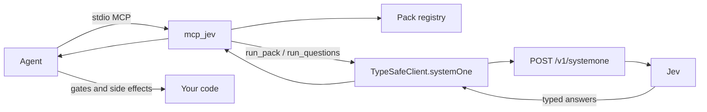

# mcp_jev

Local MCP server that runs **TypeSafe Jev** (System One) **packs** — typed **Choice / Noul / Score** judgments, not chat. When no pack fits, **`run_questions`** is the typed custom path (still System One, still not an essay).

Anyone runs it **on their own PC** with **their own** TypeSafe API key. This repo does not host Jev, proxy your key, or invent a free-form `ask_jev` tool.

**Configure the TypeSafe key once** during MCP install (`~/.mcp_jev/.env`). Any agent that attaches this MCP reuses it. Do **not** paste the key into host `mcp.json` / TOML.

**Docs (source of truth):** this repo — [https://github.com/pedroknigge/mcp_jev](https://github.com/pedroknigge/mcp_jev) · TypeSafe API: [docs.typesafe.ai](https://docs.typesafe.ai) · [llms.txt](https://docs.typesafe.ai/llms.txt)

Skill: [skills/mcp_jev/SKILL.md](skills/mcp_jev/SKILL.md) · Custom judgments: [docs/CUSTOM_JUDGMENTS.md](docs/CUSTOM_JUDGMENTS.md) · Product backlog: [docs/BACKLOG.md](docs/BACKLOG.md) · Host deep dive: [docs/INSTALL_AGENTS.md](docs/INSTALL_AGENTS.md) · Releases: [docs/RELEASES.md](docs/RELEASES.md)

- [Why mcp_jev](#why-mcp_jev)
- [Install (happy path)](#install-happy-path)
- [First-run](#first-run)
- [Verify](#verify)
- [Recipes](#recipes)
- [Update](#update)
- [Skill stays in sync](#skill-stays-in-sync)
- [Say this to your agent](#say-this-to-your-agent)
- [Install for agents & IDEs](#install-for-agents--ides)
- [Tools](#tools-closed-catalog)
- [Troubleshooting](#troubleshooting)

## Why mcp_jev

mcp_jev is the **judgment layer** for agents and harnesses. Jev is fast at **typed decisions** (one Choice, a few Nouls, a Score) over a short named state. It is not a chat model and not an executor.

Use it when the host already has structured state and needs a closed-catalog call:

| Layer | Owns |
| --- | --- |
| **Harness / agent** | Observation, tools, typed strings, merges, comments, stop rules |
| **mcp_jev** | Versioned packs or typed custom questions → `systemOne` → Choice / Noul / Score |
| **Host config** | Keyless `command` = `~/.mcp_jev/bin/mcp_jev` |

Closed tools only: `list_packs` / `describe_pack` / `run_pack` / `run_questions` / `ping`. Key-once in `~/.mcp_jev`. Patterns here follow common ecosystem loops (computer-use, review pipelines, model routing) reimplemented as packs — no copied code, no third-party trademarks. **Packs are shortcuts:** if one fits, `run_pack`. If none fits, build closed state + typed Choice / Noul / Score and call `run_questions`.

| | Jev (System One) | Chat LLM |
| --- | --- | --- |
| Input | State + closed questions | Prompt / conversation |
| Output | `choice` / `noul` / `score` + probabilities | Prose you must parse |
| Control | Your code composes answers | The model narrates a plan |
| This MCP | Runs a **pack** or typed **`run_questions`** | Out of scope |

JavaScript SDK (what this server calls):

```ts
import { choice, noul, score, TypeSafeClient } from "@typesafe-ai/sdk";

const client = new TypeSafeClient(); // reads TYPESAFE_API_KEY
await client.systemOne({
  state: { /* pack state */ },
  questions: {
    intent: choice("…", { faq: "…", action: "…" }),
    jailbreak: noul("…"),
    urgency: score("…", ["routine", "soon", "emergency"]),
  },
  model: "jev-latest",
});
```

Python exists (`typesafe-sdk`, `client.system_one`) if you are writing app code. This server is TypeScript / Node 20+.

## Install (happy path)

**Prerequisites:** Node.js **20+**, git, a TypeSafe key from [console.typesafe.ai](https://console.typesafe.ai).

```bash
# macOS / Linux — checkout ~/mcp_jev; key + wrapper in ~/.mcp_jev (override: MCP_JEV_HOME)
git clone https://github.com/pedroknigge/mcp_jev.git ~/mcp_jev
~/mcp_jev/scripts/install.sh
```

```powershell
# Windows
git clone https://github.com/pedroknigge/mcp_jev.git $HOME\mcp_jev
$HOME\mcp_jev\scripts\install.ps1
```

Already cloned? Run `./scripts/install.sh` from that checkout. `MCP_JEV_HOME` overrides the **config dir** (`~/.mcp_jev`). Optional `MCP_JEV_CHECKOUT` overrides the git checkout.

The script: clones or pulls → `npm install && npm run build` → writes `~/.mcp_jev/bin/mcp_jev` → stores `TYPESAFE_API_KEY` **once** in `~/.mcp_jev/.env` (chmod 600) → prints **keyless** snippets for Cursor, Claude Desktop, Claude Code, Codex, Grok, and Antigravity.

Non-interactive and no key → writes `~/.mcp_jev/NOT_READY`, prints a loud next step, **exits non-zero**. `mcp_jev doctor` fails until `mcp_jev config set-key`. Do not treat a missing key as a successful install.

Optional host write: `MCP_JEV_WRITE_HOSTS=all ./scripts/install.sh` (or `cursor,claude_desktop,claude_code,codex,grok,antigravity`). Merge is additive; existing servers stay.

Paste this **keyless** block (the script prints your real wrapper path):

```json
{
  "mcpServers": {
    "mcp_jev": {
      "command": "/Users/YOU/.mcp_jev/bin/mcp_jev"
    }
  }
}
```

Then **`mcp_jev doctor`** → restart the host → `ping` → `list_packs`.

Non-interactive key: `TYPESAFE_API_KEY=… ./scripts/install.sh`  
Later: `node ~/mcp_jev/dist/index.js config set-key`

### Alternatives

| Style | When |
| --- | --- |
| **Install script (prefer this)** | Humans and agents. Key once, keyless host config. |
| Git clone + manual build | `npm install && npm run build && npm test` in `REPO_PATH`. Then `node dist/index.js config set-key`. |
| `npx -y github:pedroknigge/mcp_jev` | No clone. Slow first start. Still run `config set-key` so hosts stay keyless. |
| npm registry (`npx mcp_jev`) | **Not used.** This project is not published to npm. Install from GitHub; update with `scripts/update.sh`. See [docs/RELEASES.md](docs/RELEASES.md). |

`npm test` mocks TypeSafe and must pass without a live key.

## First-run

```bash
mcp_jev doctor          # checkout, dist, wrapper, api_key_set (boolean), host registration
# or: node ~/mcp_jev/dist/index.js doctor --json
mcp_jev smoke           # stdio JSON-RPC: initialize, tools/list, ping, list_packs
~/mcp_jev/scripts/verify-mcp.sh   # same smoke as a script
npm run smoke:packs               # ping → list_packs → describe+run every pack (mocked TypeSafe)
```

On the host, after restart:

1. **`ping`** — `ok`, `packs` ≥ 12, `api_key_set` boolean. Never invent `run_pack` / `run_questions` answers if the key is missing.
2. **`list_packs`** — pick an `id`.
3. If a pack fits: **`describe_pack`** then **`run_pack`**. If none fits: **`run_questions`** (closed state + typed Choice / Noul / Score).

CLI: `mcp_jev doctor` · `mcp_jev smoke` · `mcp_jev scan <path>` · `mcp_jev hosts print` · `mcp_jev hosts write all` · `mcp_jev config set-key` · `mcp_jev config status`.

## Verify

```bash
npm test                         # unit tests; mocked TypeSafe; no live key
./scripts/verify-mcp.sh          # stdio JSON-RPC: initialize, tools/list, ping, list_packs
npm run smoke:packs              # ping → list_packs → describe_pack + run_pack(example_state) for every pack
npm run smoke:packs -- --live    # real TypeSafe from TYPESAFE_API_KEY or ~/.mcp_jev/.env
```

Default `smoke:packs` injects the same mocked `systemOne` pattern as `npm test` (no network). It prints a table (`pack`, `ok`, `ms`, `error`) and exits non-zero if any pack fails. `--live` is skipped in CI unless `TYPESAFE_API_KEY` is set and `SMOKE_LIVE=1`.

## Recipes

### `run_questions` (no pack fits)

**Packs are shortcuts.** `list_packs` first. If an id fits, `describe_pack` + `run_pack` (for example hardcoded UI copy → **`i18n_copy`**). If **no pack fits**, do **not** stop: build a closed state object and typed Choice / Noul / Score questions, then call **`run_questions`**. Same `systemOne` path as `run_pack`. Not “write me a review”. After a pattern repeats 2–3 times, upstream a named pack.

Example (public-API / changelog break — no pack): state `{ path, change_summary, symbols:[{id,kind,note}] }` + Noul `is_breaking_for_callers` + Score `doc_debt` + Choice `hottest_symbol` over symbol ids plus `none`. Full recipe: [docs/CUSTOM_JUDGMENTS.md](docs/CUSTOM_JUDGMENTS.md).

### `computer_use_step` (harness)

Code owns OCR / accessibility / DOM, clicks, and the **writer LLM** for free text. Jev only picks the next operation and a target from your closed catalogs.

1. Observe in the harness. Build `items[]` (and optional `offscreen_items[]`) with stable ids. Short `observation_summary`. **No screenshots, pixels, or image blobs in state** (rejected as `invalid_state`).
2. `run_pack` `computer_use_step` with `goal`, `app_or_url`, that observation, recent `history`, and `flags`.
3. One `systemOne` call fans out `operation` plus a separate target Choice per op (`click_target`, `type_target`, `offscreen_target`) plus `goal_achieved`, `observation_stale`, `step_confidence`. Each target question assumes its operation.
4. Prefer additive **`guidance`**: `target_for`, `ignore_targets`, `effective_targets`, `writer_owns_typed_string`, `harness_hints`. Raw `answers` stay intact. Use only the target head for the selected operation.
5. For `type_text` / `type_email`, a writer LLM (or stored value) supplies the string. `max_steps` / `max_candidates` stay in the harness.
6. Example thresholds (tune on your traces): stop if `goal_achieved.noul ≥ 0.8` or `operation` is `done`; re-observe if `observation_stale.noul ≥ 0.65` or `step_confidence.score < 1.5`.

Example state:

```json
{
  "goal": "Sign in with the saved work account",
  "app_or_url": "https://app.example.com/login",
  "observation_summary": "Login form: email focused and empty, password empty, Sign in button, Forgot password link.",
  "focused_field": "email",
  "items": [
    { "id": "email", "role": "textfield", "label": "Work email", "region": "form", "source": "ax" },
    { "id": "password", "role": "textfield", "label": "Password", "region": "form", "source": "ax" },
    { "id": "sign_in", "role": "button", "label": "Sign in", "region": "form", "source": "ax" }
  ],
  "history": [{ "action": "wait", "result": "form_visible" }],
  "flags": { "loading": false, "login_required": true }
}
```

### `model_router` (per-turn lane)

Closed lanes: `fast_local` | `strong_reasoner` | `tools_heavy` | `ask_user` | `skip`.

| Lane | Meaning |
| --- | --- |
| `fast_local` | Cheap/local or no model: lookup, format, one obvious tool |
| `strong_reasoner` | Ambiguous design, hard failure, plan not yet mechanical |
| `tools_heavy` | Long tool / browser / shell loop |
| `ask_user` | Missing preference, secret, or confirmation |
| `skip` | Already done, blocked, or out of scope |

Example thresholds (caller-owned): `route.confidence < 0.45` → `ask_user`; `unsafe_or_irreversible.noul ≥ 0.70` → refuse or confirm; `simple_lookup.noul ≥ 0.75` and `difficulty.score < 1.5` → force `fast_local`.

### Recipes table

| Need | Pack |
| --- | --- |
| Next GUI step from a closed element catalog | `computer_use_step` |
| Model cascade / per-turn compute lane | `model_router` |
| Skill select from a closed list | `skill_router` |
| Command risk signals | `command_risk` |
| Generic diff review | `review_diff` |
| Repo tree / architecture / "try Jev on these files" | `mcp_jev scan` → `code_audit` (Pass 1; not `pr_audit`) |
| Domain example: money / labor-hours / migration **PR-shaped** merge risk | `pr_audit` |
| Item / SKU locale from a **caller-supplied** closed country list | `locale_country` |
| Claimed behavior vs named tests / CI | `verify_gap` |
| One module’s imports/exports vs layer | `boundary_check` |
| Hardcoded UI copy vs i18n (`t()` / locale files) | `i18n_copy` |

Code-owned policy: keep thresholds in **your** functions (see `src/policy-examples.ts`; unit-test them without a TypeSafe key). Jev returns signals; your gate decides. Allowlist/sandbox still required for shell.

`verify_gap`: one claim vs named evidence → `verifyGapCodeGate` (`ship` \| `add_proof` \| `block`). `boundary_check`: one module’s imports/exports → `fix` (`keep` \| `extract` \| `move_layer` \| `unclear`).

### `review_diff` (staged review)

Nouls `correctness` / `security` / `reliability` / `compat` / `test_gap` → Choice `hotspot_file` from the closed `files[]` catalog → Score `severity`. Orchestration (comment, block, open a file) stays in the caller.

```json
{
  "intent": "Fail closed on reserved catalog ids",
  "diff_summary": "Adds reserved-id checks and a unit test. No auth change.",
  "files": ["src/packs/catalog-choice.ts", "test/computer-use.test.ts"]
}
```

Example thresholds: request review if any Noul ≥ 0.65; block if `security.noul ≥ 0.75` or `severity.score ≥ 2.5`.

`pr_audit` is a **domain example** pack (money / labor-hours / migration merge risk, common in ops/fintech) — **not** the universal PR pack. Keep the id. **PR-shaped state only** (`title` / `body` / `files` / `diff_summary`). General users should start with `review_diff` (diff) or `code_audit` (tree). Do not use `pr_audit` for a repo-tree scan. Never put experiment narrative in `title`/`body`. Large path-only batches (~40 files) inflate `needs_review`/`block`; path tokens (`budget`, `migration`, `finance`) move Nouls without reading bodies.

### `code_audit` (full-repo / per-file scan)

Millisecond-tier structured engineering audit (layering / blast-radius / verification style checks). **Expect ~network RTT per file; parallelize N workers.** This is not a multi-second LLM review. Jev must not receive the monorepo as prose.

**First-class harness:** `mcp_jev scan <path>` (or `node dist/cli.js scan`). Do **not** dump a tree into `pr_audit`.

```bash
mcp_jev scan . --dry-run                 # files + signals; no TypeSafe
mcp_jev scan .                           # Pass 1, concurrency 8
mcp_jev scan . --concurrency 16 --pass2 5
```

Walks the tree (respects `.gitignore`; skips binaries, images, lockfiles, `node_modules`, `.git`, generated dirs), builds compact signals, and calls `code_audit` through the same `run_pack` / `systemOne` path. JSONL to stdout (or `--jsonl PATH`); summary on stderr (top-K severity, `primary_concern` histogram, hottest paths, path-token-only flag count). Progress on stderr: files done/total, rate files/min, ETA. Missing API key → clear error (except `--dry-run`).

**Pass 1 (default, all files):** harness lists files → filter screenshots/binaries/generated vendor dirs → compact `signals` only → parallel `run_pack` `code_audit` → aggregate top `problem_severity` / most frequent Nouls.

**Pass 2 (top-N only):** resend the hottest files with a short `excerpt` (hard max 1200 chars; oversized → `invalid_state`) for confirmation. `--pass2 N` on the CLI.

**6000 files / ~2 min class:** keep Pass 1 signals-only. Concurrency default **8**; **16–32** is typical for multi-k repos (`MCP_JEV_SCAN_CONCURRENCY` or `--concurrency`). `--max-files N` samples. `--resume` continues from `.mcp_jev-scan-checkpoint.json` (written every 50 files). Recipe: parallel Pass 1 → read top severity + path-token FP note → Pass 2 excerpts on top-K only.

```bash
mcp_jev scan . --concurrency 16 --summary-only --jsonl scan.jsonl
mcp_jev scan . --concurrency 16 --pass2 20 --summary-only
mcp_jev scan . --resume --summary-only --jsonl scan.jsonl   # after interrupt
```

Example gate (`src/policy-examples.ts` `gateCodeAudit`): `ok` | `glance` | `deep_review`. Unit-test the gate without a TypeSafe key.

Pass 1 state (no body):

```json
{
  "path": "src/billing/invoice-total.ts",
  "language": "ts",
  "role_hint": "domain",
  "signals": {
    "loc": 12,
    "import_count": 1,
    "top_imports": ["money"],
    "has_tests_nearby": false,
    "touches_money": true,
    "is_generated": false,
    "complexity_heuristic": 2
  },
  "repo_context": "Billing module: invoice line totals."
}
```

Optional Mode B: one call with `files[]` (paths only) + short `batch_notes` — Choice `hotspot_file` from that closed catalog, no bodies. If `path` is also set, single-file Mode A wins.

### `i18n_copy` (hardcoded UI copy)

**Shortcut pack.** Do not rebuild this as `run_questions`. Per-file audit of hardcoded strings that should live in an i18n layer. The harness extracts a **closed** `candidates[]` catalog (max ~20). Jev does not rewrite JSX or locale JSON.

Nouls `has_user_facing_hardcoded_copy` / `should_migrate_to_i18n` / `already_partially_internationalized` → Score `i18n_debt` (0 clean → 3 blocking for a multi-locale ship) → Choice `hottest_candidate` from `candidates[].id` plus `none` → Choice `primary_bucket` (`ui_copy` | `error_message` | `marketing` | `dev_only` | `mixed` | `none`).

```json
{
  "path": "src/components/LoginForm.tsx",
  "language": "tsx",
  "framework_i18n": "next-intl",
  "uses_i18n_api": false,
  "locale_files_present": true,
  "candidates": [
    { "id": "login_heading", "text": "Login", "kind": "jsx_text", "line": 12 },
    { "id": "submit_btn", "text": "Submit", "kind": "jsx_attr", "line": 40 },
    { "id": "load_error", "text": "Error loading", "kind": "toast", "line": 55 }
  ]
}
```

Example gate (`src/policy-examples.ts` `gateI18nCopy`): `ok` | `glance` | `block`. Unit-test the gate without a TypeSafe key.

## Update

Update from the **GitHub checkout**, not npm:

```bash
~/mcp_jev/scripts/update.sh          # git pull + npm install + build; keeps ~/.mcp_jev/.env
# Windows: ~\mcp_jev\scripts\update.ps1
```

Do not `npm update -g mcp_jev` or `npx mcp_jev@latest`. Public versions are GitHub Releases (`v0.0.9` onward). Scheme: [docs/RELEASES.md](docs/RELEASES.md).

Restart the MCP host. Then **reload the skill** (hosts do not auto-reload it):

```bash
npx skills add pedroknigge/mcp_jev --skill mcp_jev
# or: cp -R ~/mcp_jev/skills/mcp_jev .cursor/skills/mcp_jev
```

## Skill stays in sync

The agent skill lives in-repo at [`skills/mcp_jev/SKILL.md`](skills/mcp_jev/SKILL.md). `scripts/update.sh` pulls that folder with the rest of the checkout; **hosts still need a re-add or copy**.

- Re-add: `npx skills add pedroknigge/mcp_jev --skill mcp_jev`
- Or copy: `cp -R skills/mcp_jev .cursor/skills/mcp_jev` (only into a project you mean to update)
- Optional: `MCP_JEV_SYNC_SKILL=1 ./scripts/update.sh` copies into `$REPO_HOME/.cursor/skills` or `~/.cursor/skills` if that directory already exists

Exact pack ids / question ids / state fields: [`skills/mcp_jev/references/pack-catalog.md`](skills/mcp_jev/references/pack-catalog.md) (generated from `src/packs/`). `npm test` fails if a new pack or question id is missing from the skill or that catalog.

## Say this to your agent

> Install and configure mcp_jev from https://github.com/pedroknigge/mcp_jev using the install script and skill. Then run doctor, ping, and list_packs.

Or: `npx skills add pedroknigge/mcp_jev --skill mcp_jev` then run `scripts/install.sh`, paste the printed snippets, restart, `doctor` → `ping` → `list_packs`.

## Install for agents & IDEs

**Easiest path:** install script → one keyless `command` pointing at `~/.mcp_jev/bin/mcp_jev` → `mcp_jev doctor` → restart → `ping`. Full stanzas in [docs/INSTALL_AGENTS.md](docs/INSTALL_AGENTS.md).

The server reads `TYPESAFE_API_KEY` from **`~/.mcp_jev/.env` (or `$MCP_JEV_HOME/.env`)**. Process env is a fallback only when the store is empty. Host configs must stay keyless.

Generic JSON (most hosts):

```json
{
  "mcpServers": {
    "mcp_jev": {
      "command": "/absolute/path/to/.mcp_jev/bin/mcp_jev"
    }
  }
}
```

Windows wrapper: `%USERPROFILE%\.mcp_jev\bin\mcp_jev.cmd`.

Print or merge snippets: `mcp_jev hosts print` · `mcp_jev hosts write all`.

### Cursor

Project: `.cursor/mcp.json` · User: `~/.cursor/mcp.json` (project wins on name clash).

Skill: `npx skills add pedroknigge/mcp_jev --skill mcp_jev` or `cp -R skills/mcp_jev .cursor/skills/mcp_jev`.

### Claude Desktop

Settings → Developer → Edit Config, then **fully quit**.

| OS | File |
| --- | --- |
| macOS | `~/Library/Application Support/Claude/claude_desktop_config.json` |
| Linux | `~/.config/Claude/claude_desktop_config.json` |
| Windows | `%APPDATA%\Claude\claude_desktop_config.json` |

Same keyless `mcpServers` JSON as Cursor.

### Claude Code

```bash
claude mcp add --scope user --transport stdio mcp_jev -- /Users/YOU/.mcp_jev/bin/mcp_jev
```

Or merge `~/.claude.json` with the generic JSON. Skill: copy to `.claude/skills/mcp_jev`.

### Codex

TOML, not JSON. `~/.codex/config.toml` or `.codex/config.toml`:

```toml
[mcp_servers.mcp_jev]
command = "/Users/YOU/.mcp_jev/bin/mcp_jev"
```

Or `codex mcp add mcp_jev -- /Users/YOU/.mcp_jev/bin/mcp_jev`.

### Grok

`~/.grok/config.toml` / `grok mcp add mcp_jev -- ~/.mcp_jev/bin/mcp_jev`. Same TOML table `[mcp_servers.mcp_jev]`.

### Antigravity

`~/.gemini/config/mcp_config.json` or `.agents/mcp_config.json` — generic JSON, `command` = wrapper.

### Other JSON / TOML hosts

Same wrapper `command`. Some editors use `context_servers` instead of `mcpServers` — see [docs/INSTALL_AGENTS.md](docs/INSTALL_AGENTS.md).

## Agent instructions

> You have **mcp_jev** (or you must install it from https://github.com/pedroknigge/mcp_jev). Jev is **not** chat. No `ask_jev`.
>
> If the MCP tools are missing: tell the user to run `scripts/install.sh` (or `install.ps1`) from that repo, paste the printed snippets, set the key once (`config set-key` / install prompt), run `mcp_jev doctor`, restart the host.
>
> Always: `list_packs`. Packs are shortcuts: if one fits, `describe_pack` → `run_pack`. If **no pack fits**, do not stop: build closed state + typed Choice / Noul / Score and call `run_questions`. Side effects stay in **your** code. Never put `TYPESAFE_API_KEY` in chat. If `ping.api_key_set` is false, run `mcp_jev config set-key` — do not embed the key in every host config.

## Tools (closed catalog)

| Tool | Args | What it does |
| --- | --- | --- |
| `list_packs` | none | `id`, `version`, `title`, `summary`, `when_to_use` |
| `describe_pack` | `pack_id` | JSON Schema, questions, `example_state`, `suggested_workflow`, `notes` |
| `run_pack` | `pack_id`, `state` | Validates state, calls TypeSafe `systemOne`, returns typed answers + usage. **No side effects.** |
| `run_questions` | `state`, `questions`, optional `model` | Fail-closed typed Choice / Noul / Score when **no pack fits**. Same `systemOne` path as `run_pack`. **No side effects.** Not chat. |
| `ping` | none | Versions, pack count, `api_key_set`, `api_key_source` (`env` \| `user_store` \| `none`). **Never** echoes the key |

There is **no** free-form ask tool. `list_packs` / `describe_pack` / `ping` never call TypeSafe. Only `run_pack` and `run_questions` do. Teaching for the custom path: [docs/CUSTOM_JUDGMENTS.md](docs/CUSTOM_JUDGMENTS.md).

## Packs

| id | What Jev judges | What **you** still do |
| --- | --- | --- |
| `pr_audit` | **Domain example** (ops/fintech): `merge_risk` (safe_ui \| needs_review \| block), Nouls money / hours / hours_money_boundary / migration, Score `blast_radius` | Staged review: risk Nouls → file Choice over `files[]` → severity. Compute **`code_gate`**. Jev does not merge or comment. Prefer `review_diff` / `code_audit` for general PR/tree review |
| `review_diff` | Nouls correctness / security / reliability / compat / test_gap; Choice `hotspot_file` from `files[]`; Score `severity` | **Default generic PR/diff pack.** Orchestration stays in the caller |
| `code_audit` | Nouls `wrong_layer` / `blast_radius` / `missing_verification` / `secret_or_credential_risk` / `inefficiency` / `dead_or_premature_abstraction`; Scores `problem_severity` + `change_cost`; Choice `primary_concern` | Pass 1: signals-only, ~RTT per file, N workers. Pass 2: short excerpt on top-N. Aggregate + `gateCodeAudit` in code |
| `skill_router` | Noul `needs_skill`; Choice `skill` from `available_skills[]`; Score `change_risk` | Load the skill in the host. Thresholds in your code |
| `command_risk` | Nouls `is_destructive` / `touches_credentials` / `scope_matches`; Score `severity` | Allowlist/sandbox still required. Signals only |
| `intent_router` | Closed intent Choice, jailbreak + policy Nouls, urgency Score | Route / refuse / hand off in code |
| `locale_country` | Catalogue item → one id from the caller’s closed `countries[]` catalog (or `unclear`) | Pass your own country list. Write the country to your catalogue |
| `computer_use_step` | Next GUI `operation` + speculative targets; Nouls `goal_achieved` / `observation_stale`; Score `step_confidence`; additive `guidance` | Observe (OCR/AX/DOM), execute the op, writer LLM for typed text, stop rules |
| `model_router` | `route` (fast_local \| strong_reasoner \| tools_heavy \| ask_user \| skip); Nouls code/browser/unsafe/lookup; Score `difficulty` | Map the lane in code. Thresholds stay in the caller |
| `verify_gap` | Nouls `has_adequate_verification` / `claim_is_testable` / `evidence_matches_claim`; Score `verification_gap` (0 none → 3 ship-blocker); Choice `next_proof` | Compute **`code_gate`** (`verifyGapCodeGate` → ship \| add_proof \| block). Jev does not write the test |
| `boundary_check` | Nouls `crosses_layer` / `leaks_domain_to_ui` / `leaks_infra_to_domain`; Score `boundary_risk`; Choice `fix` (keep \| extract \| move_layer \| unclear) | Extract / move / keep in caller code |
| `i18n_copy` | Nouls `has_user_facing_hardcoded_copy` / `should_migrate_to_i18n` / `already_partially_internationalized`; Score `i18n_debt` (0 clean → 3 blocking); Choice `hottest_candidate` from `candidates[].id`; Choice `primary_bucket` | Truncate to ~20 candidates. `gateI18nCopy` → `ok` \| `glance` \| `block`. Do not rewrite locale files here |

Packs live in `src/packs/` (in-repo). How to add one: [CONTRIBUTING.md](CONTRIBUTING.md).

**Breaking (`locale_country` 2.0.0):** country Choice options are no longer a hardcoded country list. Callers must pass `countries[]` (closed catalog of their own ids, e.g. `us`, `de`, `jp`). `unclear` remains the pack-owned refuse option.

## Architecture



## Environment

| Variable | Required | Default |
| --- | --- | --- |
| `TYPESAFE_API_KEY` | Yes, for `run_pack` / `run_questions` | From `~/.mcp_jev/.env` after install |
| `TYPESAFE_BASE_URL` | No | SDK: `https://api.typesafe.ai` |
| `JEV_MODEL` | No | `jev-latest` |
| `TYPESAFE_DEFAULT_MODEL` | No | Used if `JEV_MODEL` is unset |
| `MCP_JEV_HOME` | No | `~/.mcp_jev` (key + wrapper) |
| `MCP_JEV_CONFIG` | No | Alias for `MCP_JEV_HOME` |
| `MCP_JEV_CHECKOUT` | No | Git checkout (default `~/mcp_jev` or the repo you ran the script from) |
| `MCP_JEV_WRITE_HOSTS` | No | Install-time host write (`all` or comma list) |
| `MCP_JEV_SYNC_SKILL` | No | If `1`, install/update copy `skills/mcp_jev` into an existing `.cursor/skills` dir |
| `MCP_JEV_SCAN_CONCURRENCY` | No | Default parallel workers for `mcp_jev scan` (8; 16–32 typical for multi-k / 6000-files class) |

Repo `.env` is **not** auto-loaded. The **user store** `~/.mcp_jev/.env` is. The store wins; process env is fallback only.

CLI: `mcp_jev doctor` · `mcp_jev smoke` · `mcp_jev scan <path>` · `mcp_jev hosts print` · `mcp_jev config set-key` · `mcp_jev config status` · `mcp_jev config path`.

## Security

- Key lives in **`~/.mcp_jev/.env` (0600)**. Never in git, chat, or host JSON. Process env is fallback only if the store is empty.
- `ping` / `config status` / `doctor` never print the key.
- `scripts/update.sh` does not overwrite the key file.
- Run locally. Do not deploy this stdio binary as a public HTTP proxy.
- Pack state can contain tickets and diffs — keep diffs summarized.
- MIT licensed. Jev / TypeSafe are products of TypeSafe; this project is an independent open-source client.

## Troubleshooting

| Symptom | Fix |
| --- | --- |
| `doctor` / `NOT_READY` | Non-interactive install without a key. Run `mcp_jev config set-key`, then `mcp_jev doctor`. |
| `ping` → `api_key_set: false` | Same. Confirm `~/.mcp_jev/.env` exists. Restart the host. |
| `run_pack` / `run_questions` / `scan` → `missing_api_key` | Same. `--dry-run` still works. Do not fabricate answers. |
| `run_pack` → `auth` | Key rejected (HTTP 401). Rotate at the TypeSafe dashboard, then `config set-key`. |
| `invalid_state` | Re-read `describe_pack`. Starter packs reject extra fields. `computer_use_step` also rejects screenshots. Custom `run_questions` state must be a JSON object. |
| `invalid_questions` | `run_questions` failed schema: Choice needs 2–255 closed options; Score ≥2 levels; no free-form types. |
| `unknown_pack` | `list_packs`. If none fits, `run_questions`. There is no `ask_jev`. |
| Wrong Node | `node -v` must be 20+. GUI hosts may not see nvm. |
| stdio pollution | Wrapper and server must not write to **stdout**. |
| `npx mcp_jev` 404 | Expected. mcp_jev is not on npm. Clone GitHub and run `scripts/install.sh`; later `scripts/update.sh`. See [docs/RELEASES.md](docs/RELEASES.md). |

## Scripts

```bash
./scripts/install.sh     # happy path
./scripts/update.sh
./scripts/verify-mcp.sh  # stdio smoke, no TypeSafe call
npm run smoke:packs      # mocked run_pack for every pack
npm run build            # tsc → dist/
npm start                # node dist/index.js (MCP stdio)
npm test
npm run typecheck
mcp_jev doctor
mcp_jev smoke            # same stdio check as verify-mcp.sh
```

## License

[MIT](LICENSE)
