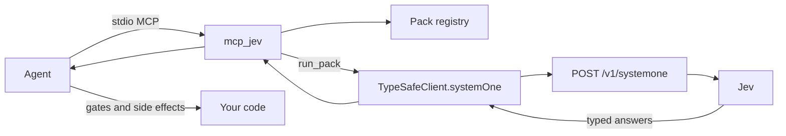

# mcp_jev

Local MCP server that runs **TypeSafe Jev** (System One) **packs** — typed **Choice / Noul / Score** judgments, not chat.

Anyone runs it **on their own PC** with **their own** TypeSafe API key. This repo does not host Jev, proxy your key, or invent a free-form `ask_jev` tool.

Jev is having a moment because it is actually a different interface: you send state and questions, you get numbers and labels your code can `if` on. Ride that — and stay honest. Side effects stay in the agent.

**Docs (source of truth):** [https://docs.typesafe.ai](https://docs.typesafe.ai) · index: [llms.txt](https://docs.typesafe.ai/llms.txt)

## Why this is not an LLM wrapper

| | Jev (System One) | Chat LLM |
| --- | --- | --- |
| Input | State + closed questions | Prompt / conversation |
| Output | `choice` / `noul` / `score` + probabilities | Prose you must parse |
| Control | Your code composes answers | The model narrates a plan |
| This MCP | Runs a **pack** | Out of scope |

JavaScript SDK (what this server calls):

```ts
import { choice, noul, score, TypeSafeClient } from "@typesafe-ai/sdk";

const client = new TypeSafeClient(); // reads TYPESAFE_API_KEY
await client.systemOne({
  state: { /* pack state */ },
  questions: {
    intent: choice("…", { faq: "…", action: "…" }),
    jailbreak: noul("…"),
    urgency: score("…", ["routine", "soon", "emergency"]),
  },
  model: "jev-latest",
});
```

Python exists (`typesafe-sdk`, `client.system_one`) if you are writing app code. This server is TypeScript / Node 20+.

## Quick start

1. Node **20+**
2. Get an API key from the [TypeSafe dashboard](https://console.typesafe.ai)
3. Install and build:

```bash
git clone https://github.com/pedroknigge/mcp_jev.git
cd mcp_jev
npm install
npm run build
export TYPESAFE_API_KEY=…   # never commit this
```

Or run without a global install:

```bash
npx mcp_jev
```

(`npx` / `node dist/index.js` speak **stdio** MCP. Do not `console.log` at it.)

Smoke without a key:

```bash
npm test          # mocks TypeSafeClient; registry must load
npm run typecheck
```

`run_pack` against the live API is skipped unless `TYPESAFE_API_KEY` is set. That is intentional.

## Cursor

Project or user `.cursor/mcp.json`:

```json
{
  "mcpServers": {
    "mcp_jev": {
      "command": "npx",
      "args": ["-y", "mcp_jev"],
      "env": {
        "TYPESAFE_API_KEY": "YOUR_KEY"
      }
    }
  }
}
```

From a clone (after `npm run build`):

```json
{
  "mcpServers": {
    "mcp_jev": {
      "command": "node",
      "args": ["/absolute/path/to/mcp_jev/dist/index.js"],
      "env": {
        "TYPESAFE_API_KEY": "YOUR_KEY"
      }
    }
  }
}
```

Optional: `TYPESAFE_BASE_URL`, `JEV_MODEL` (default `jev-latest`; the SDK also reads `TYPESAFE_DEFAULT_MODEL`).

Copy the agent skill so the model does not treat Jev like ChatGPT:

```bash
mkdir -p .cursor/skills
cp -R skills/mcp_jev .cursor/skills/mcp_jev
```

See [`skills/mcp_jev/README.md`](skills/mcp_jev/README.md) for `npx skills add` style install.

## Claude Desktop

`claude_desktop_config.json`:

```json
{
  "mcpServers": {
    "mcp_jev": {
      "command": "npx",
      "args": ["-y", "mcp_jev"],
      "env": {
        "TYPESAFE_API_KEY": "YOUR_KEY"
      }
    }
  }
}
```

## Tools (closed catalog)

| Tool | What it does |
| --- | --- |
| `list_packs` | `id`, `title`, `summary`, `when_to_use` |
| `describe_pack` | JSON Schema, questions, example state, suggested workflow |
| `run_pack` | `{ pack_id, state }` → typed answers + usage. Validates state. Clear error if the key is missing |
| `ping` | SDK version, pack count, `api_key_set` — **never** echoes the key |

There is **no** free-form ask tool. Agents: `list_packs` → `describe_pack` → `run_pack`.

## Packs

| id | What Jev judges | What **you** still do |
| --- | --- | --- |
| `pr_audit` | `merge_risk` (safe_ui \| needs_review \| block), Nouls money / hours / hours_money_boundary / migration, Score `blast_radius` | Compute **`code_gate`** in the caller. Jev does not merge or comment |
| `intent_router` | Closed intent Choice, jailbreak + policy Nouls, urgency Score | Route / refuse / hand off in code |
| `locale_country` | Catalogue item → Argentina \| USA \| India \| Uruguay \| Saudi Arabia (or `unclear`) | Write the country to your catalogue |

Packs live in `src/packs/`. How to add one: [CONTRIBUTING.md](CONTRIBUTING.md).

## Architecture



`list_packs` / `describe_pack` / `ping` never call TypeSafe. Only `run_pack` does.

## Environment

| Variable | Required | Default |
| --- | --- | --- |
| `TYPESAFE_API_KEY` | Yes, for `run_pack` | — |
| `TYPESAFE_BASE_URL` | No | SDK: `https://api.typesafe.ai` |
| `JEV_MODEL` | No | `jev-latest` |

See `.env.example`. Copy to `.env` for local shells only.

## Security

- The key stays in **your** process environment. This server does not log it, return it from `ping`, or send it anywhere except the TypeSafe API (via the official SDK).
- Run locally. Do not deploy this stdio binary as a public HTTP proxy.
- Pack state can contain tickets, diffs, and catalogue copy — treat it as sensitive. Keep diffs summarized.
- MIT licensed. Jev / TypeSafe are products of TypeSafe; this project is an independent open-source client.

## Scripts

```bash
npm run build        # tsc → dist/
npm start            # node dist/index.js
npm run typecheck
npm test
```

## License

[MIT](LICENSE)
