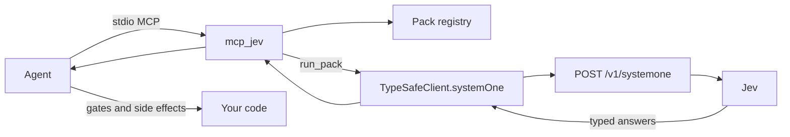

# mcp_jev

Local MCP server that runs **TypeSafe Jev** (System One) **packs** — typed **Choice / Noul / Score** judgments, not chat.

Anyone runs it **on their own PC** with **their own** TypeSafe API key. This repo does not host Jev, proxy your key, or invent a free-form `ask_jev` tool.

**Configure the TypeSafe key once** during MCP install (`~/.mcp_jev/.env`). Any agent that attaches this MCP reuses it. Do **not** paste the key into Cursor / Claude / Codex / Grok `mcp.json`.

**Docs (source of truth):** this repo — [https://github.com/pedroknigge/mcp_jev](https://github.com/pedroknigge/mcp_jev) · TypeSafe API: [docs.typesafe.ai](https://docs.typesafe.ai) · [llms.txt](https://docs.typesafe.ai/llms.txt)

Skill: [skills/mcp_jev/SKILL.md](skills/mcp_jev/SKILL.md) · Host deep dive: [docs/INSTALL_AGENTS.md](docs/INSTALL_AGENTS.md)

- [Install (happy path)](#install-happy-path)
- [Update](#update)
- [Say this to your agent](#say-this-to-your-agent)
- [Why this is not an LLM wrapper](#why-this-is-not-an-llm-wrapper)
- [Install for agents & IDEs](#install-for-agents--ides)
- [Tools](#tools-closed-catalog)
- [Troubleshooting](#troubleshooting)

## Install (happy path)

**Prerequisites:** Node.js **20+**, git, a TypeSafe key from [console.typesafe.ai](https://console.typesafe.ai).

```bash
# macOS / Linux — checkout ~/mcp_jev; key + wrapper in ~/.mcp_jev (override: MCP_JEV_HOME)
git clone https://github.com/pedroknigge/mcp_jev.git ~/mcp_jev
~/mcp_jev/scripts/install.sh
```

```powershell
# Windows
git clone https://github.com/pedroknigge/mcp_jev.git $HOME\mcp_jev
$HOME\mcp_jev\scripts\install.ps1
```

Already cloned (e.g. Pedro’s Desktop path `/Users/pedroknigge/Desktop/mcp_jev`)? Run `./scripts/install.sh` from that repo. `MCP_JEV_HOME` overrides the **config dir** (`~/.mcp_jev`). Optional `MCP_JEV_CHECKOUT` overrides the git checkout.

The script: clones or pulls → `npm install && npm run build` → writes `~/.mcp_jev/bin/mcp_jev` → stores `TYPESAFE_API_KEY` **once** in `~/.mcp_jev/.env` (chmod 600) → prints/copies the MCP JSON.

Paste this **keyless** block (the script prints your real wrapper path):

```json
{
  "mcpServers": {
    "mcp_jev": {
      "command": "/Users/YOU/.mcp_jev/bin/mcp_jev"
    }
  }
}
```

Cursor: `~/.cursor/mcp.json` or `.cursor/mcp.json`  
Claude Desktop: `claude_desktop_config.json` (paths below)  
Then **restart the host** → `ping` → `list_packs`.

Non-interactive key: `TYPESAFE_API_KEY=… ./scripts/install.sh`  
Later: `node ~/mcp_jev/dist/index.js config set-key`

### Alternatives

| Style | When |
| --- | --- |
| **Install script (prefer this)** | Humans and agents. Key once, keyless host config. |
| Git clone + manual build | `npm install && npm run build && npm test` in `REPO_PATH`. Then `node dist/index.js config set-key`. |
| `npx -y github:pedroknigge/mcp_jev` | No clone. Slow first start. Still run `config set-key` so hosts stay keyless. |
| `npx -y mcp_jev` | **Not on npm yet.** Future published bin (`mcp_jev` → `dist/index.js`). |

`npm test` mocks TypeSafe and must pass without a live key.

## Update

```bash
~/mcp_jev/scripts/update.sh          # git pull + npm install + build; keeps ~/.mcp_jev/.env
# Windows: ~\mcp_jev\scripts\update.ps1
```

Restart the MCP host. That is the whole update.

## Say this to your agent

> Install and configure mcp_jev from https://github.com/pedroknigge/mcp_jev using the install script and skill.

Or: `npx skills add pedroknigge/mcp_jev --skill mcp_jev` then run `scripts/install.sh`, paste the printed JSON, restart, `ping` → `list_packs`.

## Why this is not an LLM wrapper

| | Jev (System One) | Chat LLM |
| --- | --- | --- |
| Input | State + closed questions | Prompt / conversation |
| Output | `choice` / `noul` / `score` + probabilities | Prose you must parse |
| Control | Your code composes answers | The model narrates a plan |
| This MCP | Runs a **pack** | Out of scope |

JavaScript SDK (what this server calls):

```ts
import { choice, noul, score, TypeSafeClient } from "@typesafe-ai/sdk";

const client = new TypeSafeClient(); // reads TYPESAFE_API_KEY
await client.systemOne({
  state: { /* pack state */ },
  questions: {
    intent: choice("…", { faq: "…", action: "…" }),
    jailbreak: noul("…"),
    urgency: score("…", ["routine", "soon", "emergency"]),
  },
  model: "jev-latest",
});
```

Python exists (`typesafe-sdk`, `client.system_one`) if you are writing app code. This server is TypeScript / Node 20+.

## Install for agents & IDEs

**Easiest path:** install script → one keyless `command` pointing at `~/.mcp_jev/bin/mcp_jev` → restart → `ping`. Other hosts below; full stanzas in [docs/INSTALL_AGENTS.md](docs/INSTALL_AGENTS.md).

The server reads `TYPESAFE_API_KEY` from **`~/.mcp_jev/.env` (or `$MCP_JEV_HOME/.env`)**. Process env is a fallback only when the store is empty. Host `mcp.json` must stay keyless.

Generic JSON (most hosts):

```json
{
  "mcpServers": {
    "mcp_jev": {
      "command": "/absolute/path/to/.mcp_jev/bin/mcp_jev"
    }
  }
}
```

Windows wrapper: `%USERPROFILE%\.mcp_jev\bin\mcp_jev.cmd`.

### Cursor

Project: `.cursor/mcp.json` · User: `~/.cursor/mcp.json` (project wins on name clash).

```json
{
  "mcpServers": {
    "mcp_jev": {
      "command": "/Users/pedroknigge/.mcp_jev/bin/mcp_jev"
    }
  }
}
```

Skill: `npx skills add pedroknigge/mcp_jev --skill mcp_jev` or `cp -R skills/mcp_jev .cursor/skills/mcp_jev`.

### Claude Desktop

Settings → Developer → Edit Config, then **fully quit**.

| OS | File |
| --- | --- |
| macOS | `~/Library/Application Support/Claude/claude_desktop_config.json` |
| Linux | `~/.config/Claude/claude_desktop_config.json` |
| Windows | `%APPDATA%\Claude\claude_desktop_config.json` |

Same keyless `mcpServers` JSON as Cursor.

### Claude Code

```bash
claude mcp add --scope user --transport stdio mcp_jev -- /Users/YOU/.mcp_jev/bin/mcp_jev
```

Skill: `npx skills add pedroknigge/mcp_jev --skill mcp_jev` or copy to `.claude/skills/mcp_jev`.

### OpenAI Codex

TOML, not JSON. `~/.codex/config.toml` or `.codex/config.toml`:

```toml
[mcp_servers.mcp_jev]
command = "/Users/YOU/.mcp_jev/bin/mcp_jev"
```

Or `codex mcp add mcp_jev -- /Users/YOU/.mcp_jev/bin/mcp_jev`. If you only have JSON, paste the generic block into JSON hosts.

### Grok / xAI

`~/.grok/config.toml` / `grok mcp add mcp_jev -- ~/.mcp_jev/bin/mcp_jev`. Same TOML table `[mcp_servers.mcp_jev]`. JSON hosts: generic `mcpServers` block.

### Google Antigravity

`~/.gemini/config/mcp_config.json` or `.agents/mcp_config.json` — generic JSON, `command` = wrapper. UI: … → MCP Servers → View raw config. Skill fallback if a surface cannot spawn stdio.

### Windsurf / Cline / Continue / Zed

| Host | File | Note |
| --- | --- | --- |
| Windsurf | `~/.codeium/windsurf/mcp_config.json` | `mcpServers` + wrapper `command` |
| Cline | MCP panel → Configure; often `cline_mcp_settings.json` or `~/.cline/mcp.json` | `mcpServers` |
| Continue | `.continue/mcpServers/*.yaml` or JSON in that folder | `command: ~/.mcp_jev/bin/mcp_jev` |
| Zed | `~/.config/zed/settings.json` | **`context_servers`**, not `mcpServers` |

Zed:

```json
{
  "context_servers": {
    "mcp_jev": {
      "command": "/Users/YOU/.mcp_jev/bin/mcp_jev"
    }
  }
}
```

## Agent instructions

> You have **mcp_jev** (or you must install it from https://github.com/pedroknigge/mcp_jev). Jev is **not** chat. No `ask_jev`.
>
> If the MCP tools are missing: tell the user to run `scripts/install.sh` (or `install.ps1`) from that repo, paste the printed JSON, set the key once (`config set-key` / install prompt), restart the host.
>
> Always: `list_packs` → `describe_pack` → `run_pack`. Side effects stay in **your** code. Never put `TYPESAFE_API_KEY` in chat. If `ping.api_key_set` is false, run `mcp_jev config set-key` — do not embed the key in every host config.

## Tools (closed catalog)

| Tool | Args | What it does |
| --- | --- | --- |
| `list_packs` | none | `id`, `version`, `title`, `summary`, `when_to_use` |
| `describe_pack` | `pack_id` | JSON Schema, questions, `example_state`, `suggested_workflow`, `notes` |
| `run_pack` | `pack_id`, `state` | Validates state, calls TypeSafe `systemOne`, returns typed answers + usage. **No side effects.** |
| `ping` | none | Versions, pack count, `api_key_set`, `api_key_source` (`env` \| `user_store` \| `none`). **Never** echoes the key |

There is **no** free-form ask tool. `list_packs` / `describe_pack` / `ping` never call TypeSafe. Only `run_pack` does.

## Packs

| id | What Jev judges | What **you** still do |
| --- | --- | --- |
| `pr_audit` | `merge_risk` (safe_ui \| needs_review \| block), Nouls money / hours / hours_money_boundary / migration, Score `blast_radius` | Compute **`code_gate`**. Jev does not merge or comment |
| `intent_router` | Closed intent Choice, jailbreak + policy Nouls, urgency Score | Route / refuse / hand off in code |
| `locale_country` | Catalogue item → Argentina \| USA \| India \| Uruguay \| Saudi Arabia (or `unclear`) | Write the country to your catalogue |

Packs live in `src/packs/` (in-repo). How to add one: [CONTRIBUTING.md](CONTRIBUTING.md).

## Architecture



## Environment

| Variable | Required | Default |
| --- | --- | --- |
| `TYPESAFE_API_KEY` | Yes, for `run_pack` | From `~/.mcp_jev/.env` after install |
| `TYPESAFE_BASE_URL` | No | SDK: `https://api.typesafe.ai` |
| `JEV_MODEL` | No | `jev-latest` |
| `TYPESAFE_DEFAULT_MODEL` | No | Used if `JEV_MODEL` is unset |
| `MCP_JEV_HOME` | No | `~/.mcp_jev` (key + wrapper) |
| `MCP_JEV_CONFIG` | No | Alias for `MCP_JEV_HOME` |
| `MCP_JEV_CHECKOUT` | No | Git checkout (default `~/mcp_jev` or the repo you ran the script from) |

Repo `.env` is **not** auto-loaded. The **user store** `~/.mcp_jev/.env` is. The store wins; process env is fallback only.

CLI: `mcp_jev config set-key` · `mcp_jev config status` · `mcp_jev config path`.

## Security

- Key lives in **`~/.mcp_jev/.env` (0600)**. Never in git, chat, or host JSON. Process env is fallback only if the store is empty.
- `ping` / `config status` never print the key.
- `scripts/update.sh` does not overwrite the key file.
- Run locally. Do not deploy this stdio binary as a public HTTP proxy.
- Pack state can contain tickets and diffs — keep diffs summarized.
- MIT licensed. Jev / TypeSafe are products of TypeSafe; this project is an independent open-source client.

## Troubleshooting

| Symptom | Fix |
| --- | --- |
| `ping` → `api_key_set: false` | Run `mcp_jev config set-key` (or `node ~/mcp_jev/dist/index.js config set-key`). Confirm `~/.mcp_jev/.env` exists. Restart the host. |
| `run_pack` → `missing_api_key` | Same. Do not fabricate answers. |
| `run_pack` → `auth` | Key rejected (HTTP 401). Rotate at the TypeSafe dashboard, then `config set-key`. |
| `invalid_state` | Re-read `describe_pack`. Starter packs reject extra fields. |
| `unknown_pack` | `list_packs`. There is no `ask_jev`. |
| Wrong Node | `node -v` must be 20+. GUI hosts may not see nvm. |
| stdio pollution | Wrapper and server must not write to **stdout**. |
| `npx mcp_jev` 404 | Not on npm yet. Use the install script or `npx -y github:pedroknigge/mcp_jev`. |

## Scripts

```bash
./scripts/install.sh     # happy path
./scripts/update.sh
npm run build            # tsc → dist/
npm start                # node dist/index.js (MCP stdio)
npm test
npm run typecheck
```

## License

[MIT](LICENSE)
